# 🏕️ 户外运动社交管理系统

# 获取方式---本文件是项目的部分文件，有需要可看【煮页】

# 联系🐧: 3660038549

<br>

如需部署，请按“前台启动方式”和“后台启动方式”完成数据库导入、配置修改、项目启动和页面访问。

🌄 场景聚焦：面向户外运动活动组织与社交互动业务，覆盖活动展示、分类浏览、活动报名、动态发布、评论点赞、私信沟通等完整流程。

🔐 角色权限：系统内置管理员、活动发起者、普通用户三类角色，不同角色登录后进入对应界面并拥有独立功能菜单。

🗓️ 活动闭环：用户可浏览活动、查看详情、提交报名、查看报名记录，活动发起者可发布活动、审核报名、取消或结束活动。

🖼️ 图片管理：支持活动封面、分类图标、首页轮播图、用户头像上传与访问，满足前台展示和后台维护需求。

📊 数据统计：后台提供平台概览、用户趋势、活动分类统计、活动状态统计等统计数据，便于管理员掌握运营情况。

📢 内容运营：管理员可维护活动分类、首页轮播图、公告通知、活动审核、动态审核和用户状态，便于持续更新平台内容。

#### 安装环境

JAVA 环境：JDK 1.8

Node.js 环境：本项目为 SpringBoot + Thymeleaf 前后端一体项目，无需单独安装 Node.js

Maven 环境：建议 Maven 3.6+

MySQL 数据库：建议 MySQL 5.7 或 MySQL 8.0，请提前记住数据库账号和密码

IDEA 编译器：推荐使用 IntelliJ IDEA 导入项目

前端开发工具：页面模板集成在后端项目中，可使用 IDEA、VS Code 或 WebStorm 编辑 HTML/CSS/JS

浏览器：Chrome、Edge 等现代浏览器均可

#### 采用技术及功能

后端：SpringBoot 2.7.18、Spring MVC、MyBatis-Plus、MySQL、Lombok、Hutool、Kaptcha、Commons FileUpload

前端：Thymeleaf、HTML、CSS、JavaScript

数据库：MySQL，项目 SQL 脚本为 `outdoor_sports.sql`

平台前端：Thymeleaf(服务端模板) + HTML/CSS/JavaScript(页面交互) + 静态资源目录(图片、样式、脚本)

平台后台：SpringBoot(核心框架) + Spring MVC(请求处理) + MyBatis-Plus(ORM) + MySQL(数据库) + Thymeleaf(页面渲染)

开发环境：Windows10/Windows11、IntelliJ IDEA、Maven、JDK 1.8、MySQL、Chrome/Edge

1、实现用户登录、注册、退出、个人信息维护、修改密码、头像上传等基础功能；

2、实现三类角色管理，包括管理员、活动发起者、普通用户，并根据角色进入不同功能界面；

3、实现户外活动管理，包括活动标题、分类、封面、地点、时间、人数、费用、要求、状态等内容维护；

4、实现活动分类管理，包括分类新增、编辑、删除、启用禁用、排序和图标维护；

5、实现首页轮播图管理，包括轮播图新增、编辑、删除、排序、状态维护和展示配置；

6、实现用户端活动浏览，包括首页轮播展示、活动分类筛选、活动列表、活动详情和公告查看；

7、实现活动报名流程，包括提交报名、取消报名、报名记录查看、发起者审核报名和活动通知；

8、实现社区动态功能，包括动态发布、动态列表、动态点赞、动态评论、关注用户和私信聊天；

9、实现后台运营管理，包括用户管理、活动审核、动态审核、公告管理、轮播图管理和数据统计。

#### 前台启动方式

1. 本项目无独立前端工程，前台页面位于 `src/main/resources/templates/front`。

2. 前台静态资源位于 `src/main/resources/static`。

3. 完成“后台启动方式”中的数据库导入、配置修改和 SpringBoot 项目启动。

4. 浏览器访问：`http://localhost:8080/`

说明：前台页面由 Thymeleaf 模板渲染，请求接口统一由本项目 SpringBoot 服务提供，无需额外启动 Vite、Vue 或 Nginx 代理。

#### 后台启动方式

1. 创建数据库 `outdoor_sports`。

2. 导入项目根目录下的 `outdoor_sports.sql`。

3. 修改 `src/main/resources/application.yml` 中的 MySQL 连接配置：

```yaml
spring:
  datasource:
    url: jdbc:mysql://localhost:3306/outdoor_sports?useUnicode=true&characterEncoding=utf-8&useSSL=false&serverTimezone=Asia/Shanghai&allowPublicKeyRetrieval=true
    username: root
    password: 123456
```

4. 使用 IDEA 打开项目，等待 Maven 依赖下载完成。

5. 启动 `src/main/java/com/outdoor/OutdoorApplication.java`。

6. 浏览器访问：`http://localhost:8080/admin`

也可以在项目根目录使用 Maven 命令启动：

```bash
mvn spring-boot:run
```

也可以先打包再运行：

```bash
mvn clean package -DskipTests
java -jar target/hwyd-1.0.0.jar
```

#### 默认后台账户密码

[管理员]

账号：`admin`

密码：`123456`

[活动发起者]

账号：`organizer1`

密码：`123456`

[普通用户]

账号：`user1`

密码：`123456`

#### 核心模块

| 模块 | 功能说明 |
|:---|:---|
| 用户管理 | 登录、注册、退出、个人信息维护、密码修改、头像上传、用户状态管理 |
| 活动管理 | 活动新增、编辑、删除、发布、取消、结束、详情查看、活动审核 |
| 分类管理 | 分类新增、编辑、删除、排序、状态维护、分类图标维护 |
| 轮播图管理 | 轮播图新增、编辑、删除、启用禁用、排序维护 |
| 报名管理 | 活动报名、取消报名、报名列表、报名审核、活动通知 |
| 社区互动 | 动态发布、点赞、评论、关注、粉丝、关注动态、私信消息 |
| 内容管理 | 公告发布、公告编辑、公告删除、公告列表、公告详情 |
| 数据统计 | 平台概览、用户趋势、活动分类统计、活动状态统计 |

#### 项目结构

```text
hwyd
├── src/main/java/com/outdoor
│   ├── common/                    # 通用返回结构与常量
│   ├── config/                    # Web、验证码等配置
│   ├── controller/                # 控制器
│   ├── entity/                    # 实体类
│   ├── interceptor/               # 登录拦截器
│   ├── mapper/                    # MyBatis-Plus Mapper
│   ├── service/                   # 业务接口与实现
│   └── OutdoorApplication.java    # 项目启动类
├── src/main/resources
│   ├── mapper/                    # MyBatis XML 映射文件
│   ├── static/                    # 静态资源目录
│   │   ├── css/                   # 样式文件
│   │   ├── js/                    # 脚本文件
│   │   └── images/                # 图片资源
│   ├── templates/                 # Thymeleaf 页面模板
│   │   ├── admin/                 # 管理员后台页面
│   │   └── front/                 # 前台、用户端、发起者页面
│   └── application.yml            # 项目配置文件
├── outdoor_sports.sql             # 数据库脚本
├── pom.xml                        # Maven 配置
└── README.md                      # 项目说明
```

#### 项目截图

项目运行后可查看以下页面效果：

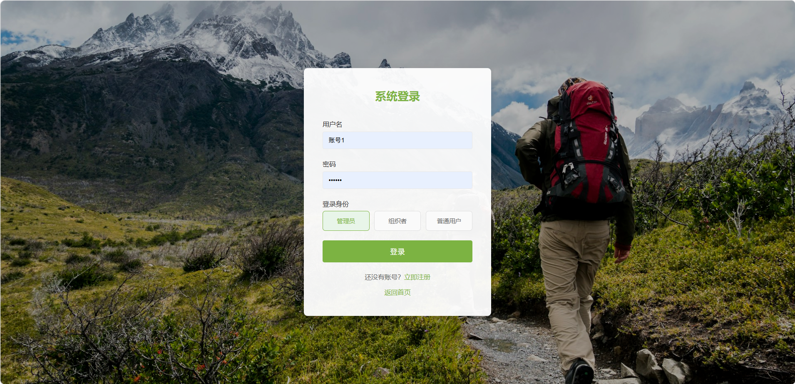
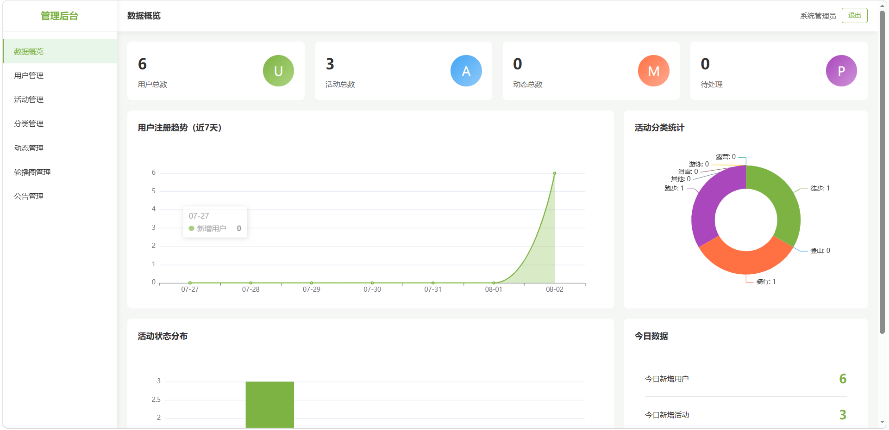
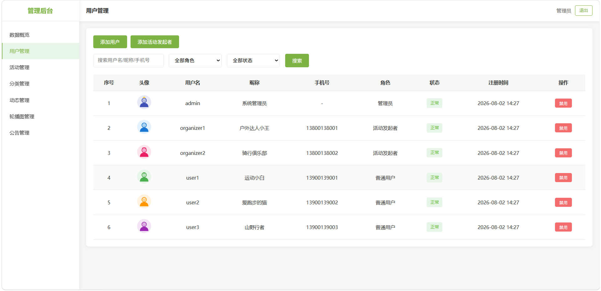
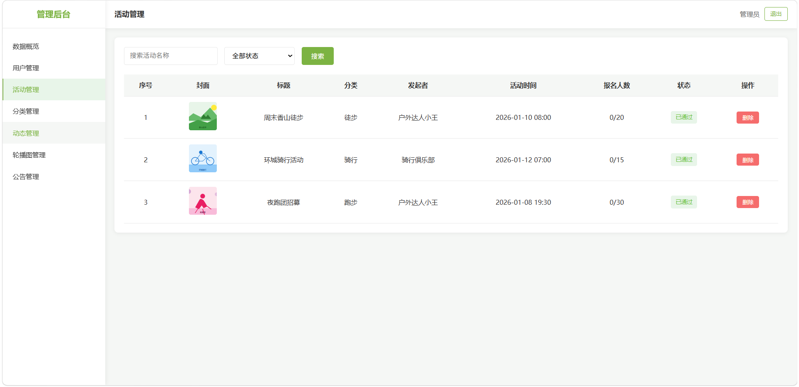
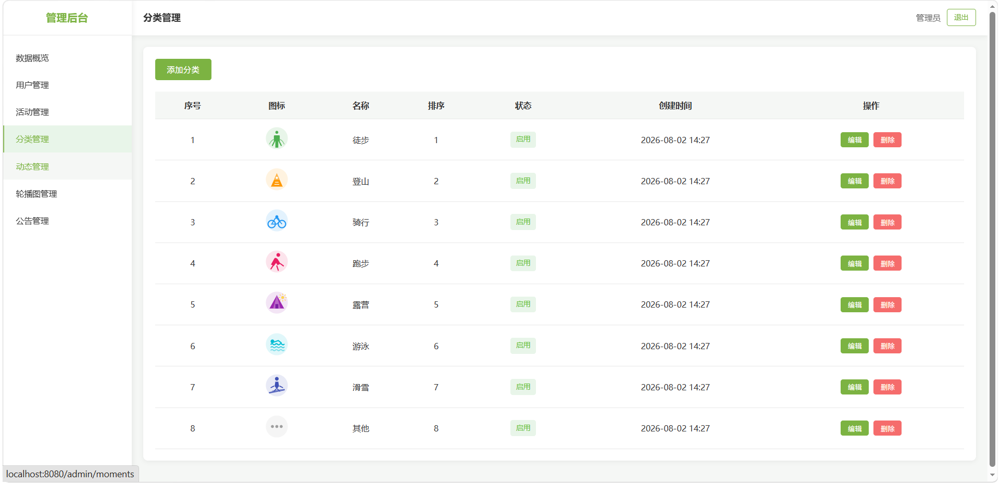
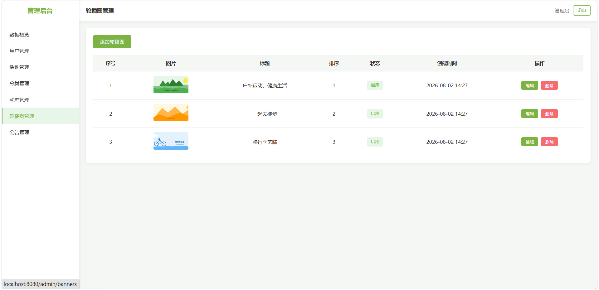
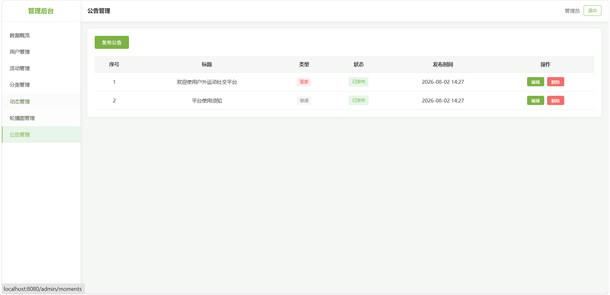
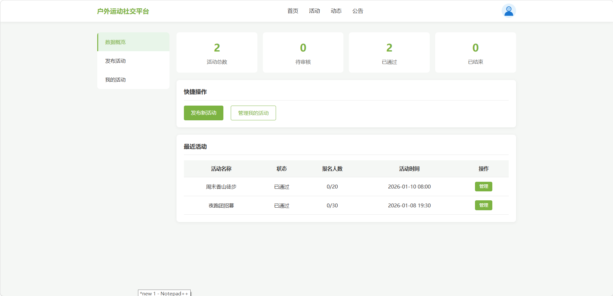
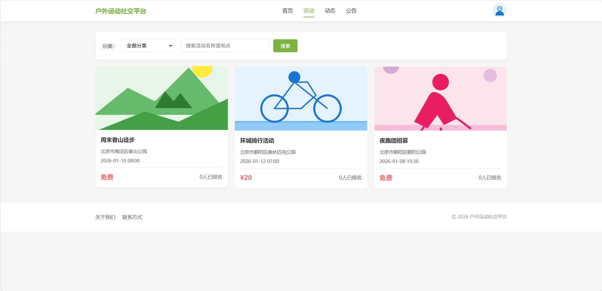
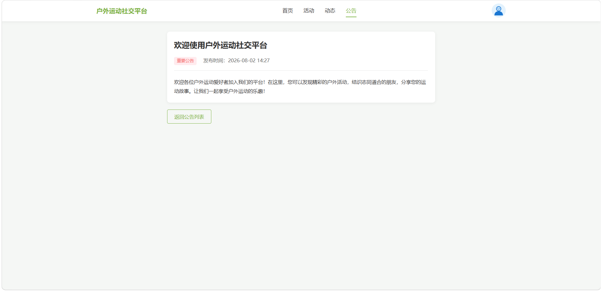
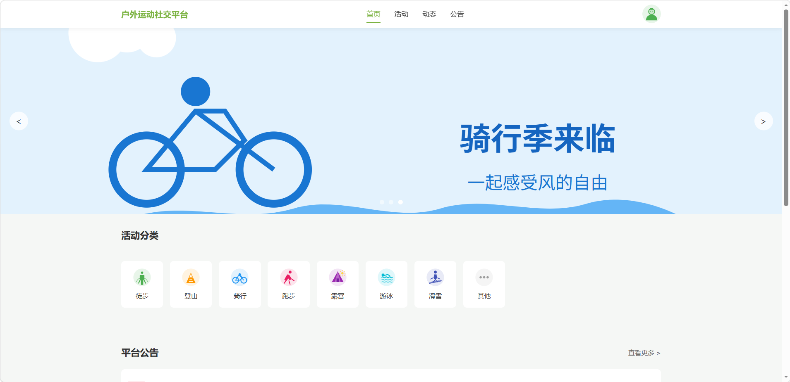
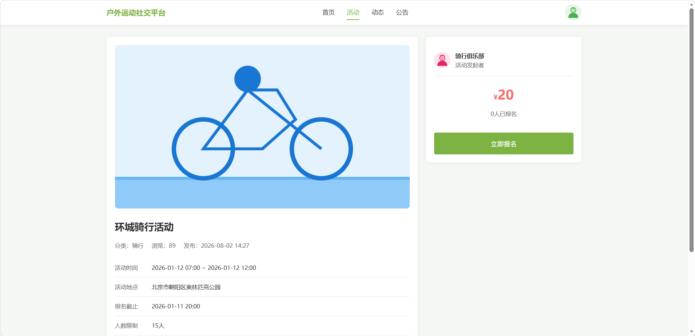
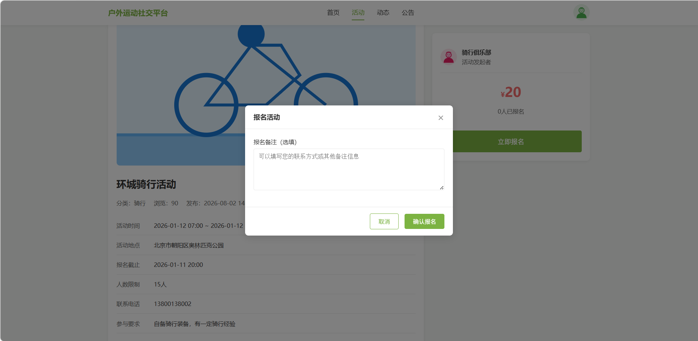

#### 常见问题

1、数据库连接失败：检查 MySQL 是否启动，确认 `application.yml` 中数据库名、账号、密码是否正确。

2、SQL 导入后没有表：请确认 `outdoor_sports.sql` 已真正导入 `outdoor_sports` 数据库，而不是仅创建了空库。

3、项目启动失败：请检查 JDK 是否为 1.8，Maven 依赖是否下载完成，`8080` 端口是否被占用。

4、图片上传或显示失败：请检查 `src/main/resources/static/images` 目录是否存在，是否具有读写权限，以及数据库中的图片路径是否正确。
